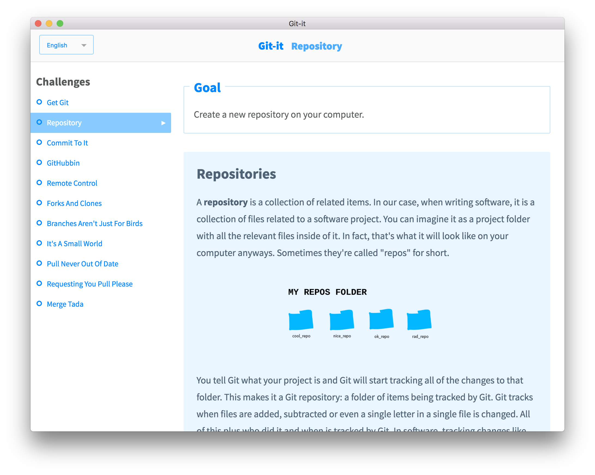
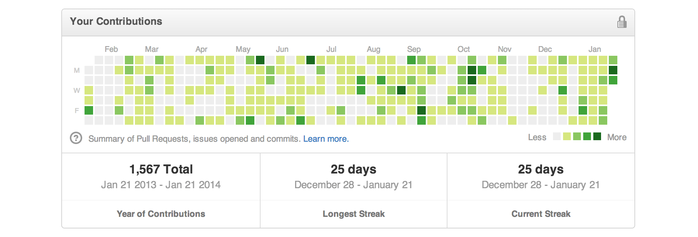

# Git-it (Desktop App)

  

Git-it is a desktop (Mac, Windows and Linux) app that teaches you how to use Git and GitHub on the [command line](https://en.wikipedia.org/wiki/Command-line_interface).

**🚩The app includes translations in several languages: English, German, Spanish, French, Japanese, Korean, Polish, Portuguese, Ukrainian and traditional Chinese. 🚩**
_Due to Code-Changes on handling translations, some translations are currently not visible as translated. The translations still need to be copied over to transifex, contributions are welcome! (see section 'Translations' and [#77](https://github.com/jotoeri/git-it-electron/issues/77))_

**The app was originally created by Jessica Lord ([jlord](https://github.com/jlord)) and it's current state is still strongly dependent on her Repositories and the operation of Reporobot on her servers. As the app seemed to be unmaintained, i ([jotoeri](https://github.com/jotoeri)) took it over to update dependencies and content, as it would have been a pity to see such a great tutorial die. However, i am willing to transfer it back to Jessica if she wants.**

---
## Hello future Forkers, Branchers and Pull Requesters!

This application contains challenges for learning Git and GitHub—by using _real_ Git and GitHub, not emulators. You'll be learning the awesome (and not so scary) command line and GitHub which means when you finish all of the challenges you'll have _real_ repositories on your GitHub account and green squares on your [contribution chart](https://github.com/blog/1360-introducing-contributions).

## What to Install

You will need this app, Git-it as well as a text editor. You'll also of course need Git and the first challenge in Git-it helps you get that set up. But if you want to get a head start, go for it! You'll continue to use Git and your text editor throughout your bright social coding future.

As a part of the challenges you'll also create a (free) account on GitHub. If you've already got one, high-five!

#### Git

We recommend installing Git on your computer by installing the [latest version](https://git-scm.com/downloads) from the Git website.

Note—If you're using Windows, you should use the **Git Shell** app as your terminal—it is installed with Git. In Mac and Linux you can use the app **Terminal**, which is already on your computer.

#### Text Editor

I'm quite partial (I'm on the team!) but [Atom](http://atom.io) is a great text editor (also free) and it is built on [Electron.js](http://electron.atom.io), just like Git-it. Visit the website and download the version for your operating system. [Sublime](https://www.sublimetext.com), [Microsoft VS Code](https://code.visualstudio.com) and [Adobe Brackets](http://brackets.io) are other options.

#### Git-it

You can view the [releases](http://github.com/jotoeri/git-it-electron/releases) section of this repository to find the download for your operating system. Click to download your version. Once it has downloaded to your default Downloads directory, unzip the folder and run the Git-it executable. The executables for Mac, Windows and Linux:

- **Mac** Right (control) click the Git-it icon, select Open and then Open again. You can drag the icon into your Applications directory if you want, but it's not required. If needed, more [detailed installation instructions](https://github.com/jlord/git-it-electron/issues/121#issue-149747488) can be found in this issue.
- **Windows** Double-click the executable.
- **Linux** Double-click the executable. If the app isn't running, [see this issue](https://github.com/jlord/git-it-electron/issues/182).

## Get Started!

Open Git-it and click the button to begin the first challenge. Have your terminal and text editor open, too. Follow along with the instructions in each challenge and use the terminal or editor as instructed.

When you've completed the steps in a challenge click 'Verify'. Depending on the challenge you may need to also select the folder you did your work in for Git-it to verify.

**Questions?** [Open an issue](http://github.com/jotoeri/git-it-electron/issues/new) on this repository.

**Want to contribute or build locally?** See the [contributing documentation](CONTRIBUTING.md)

---

### Tips For Getting Started

**Code snippets** often times look like `$ some code-stuff --here`. The dollar sign identifies the line as one a user would enter into the command line, but you don't actually include it when you type it into terminal. In this case, you'd actually just type `some code-stuff --here`.

**Variables** are indicated by `<VARIABLENAME>` in code snippets. When you actually use the line of code, replace `<VARIABLENAME>`, with your variable. For instance to make a new folder in terminal the format is, `mkdir <FOLDERNAME>`, so if you wanted to make a folder named 'octocat', you'd type: `mkdir octocat`.

**Command line, terminal and bash** all basically mean the same thing: the MS-DOS, Doogie Howser looking screen full of words and numbers. It's awesomely powerful and allows you to control your computer with text commands.

You can do a lot of things from your terminal like delete, rename, copy or create files and folders; run scripts and send things back and forth between servers (like the ones storing things on GitHub.com) and your computer (also a server!).

## Translations
You found some english text on the translated content? That might happen, if we changed some content on the english base but the appropriate translation is still missing. We are happy on every contribution, so feel free to head over to the [Transifex Project](https://www.transifex.com/git-it/git-it-electron) to insert the right translations there! The next release will then be a bit more complete! :relaxed::tada:
